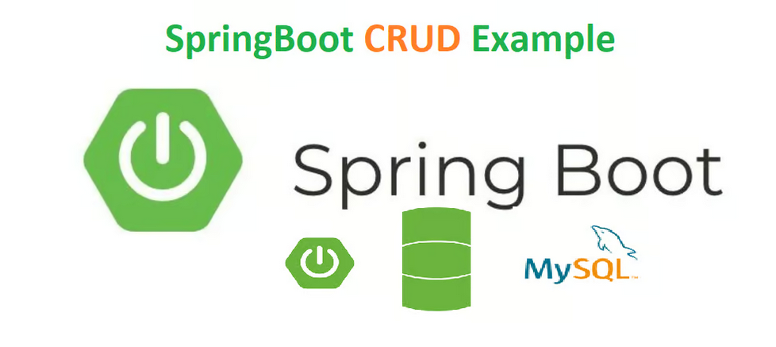
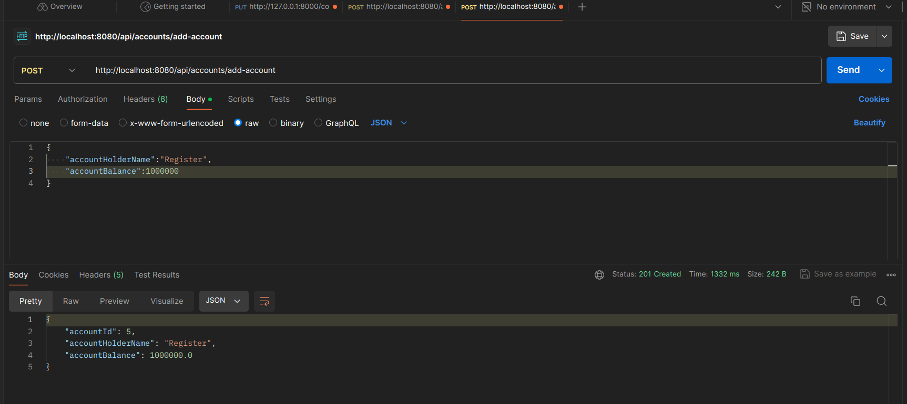
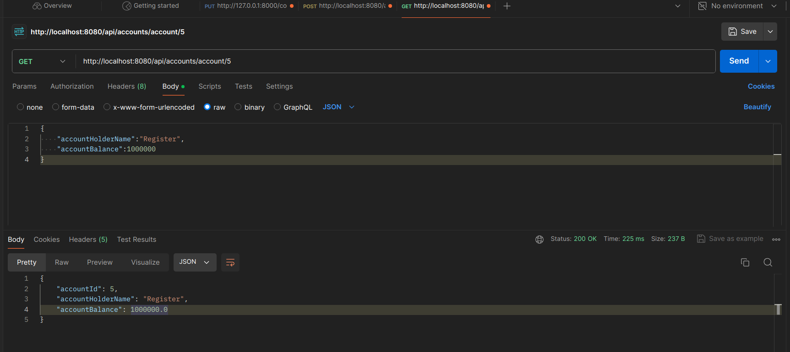
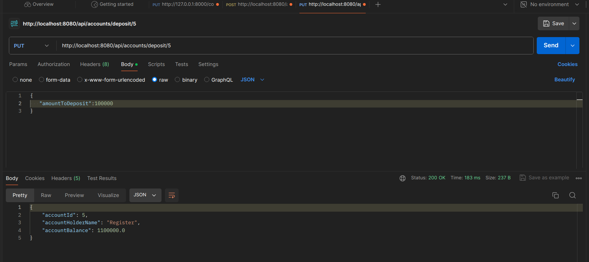
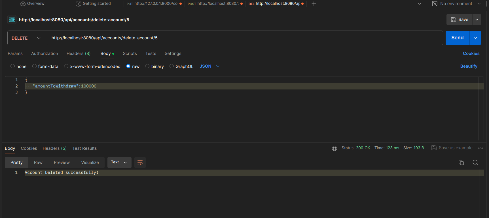
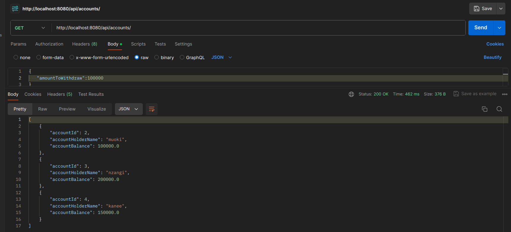

## Banking Account REST API



## Documentation
To connect the API with your database you need change the application.properties file <br>
[application.properties file](https://github.com/nzangi/banking-account-rest-api/blob/main/src/main/resources/application.properties)
### application.properties file
```angular2html
spring.application.name=banking-application

spring.datasource.url=jdbc:mysql://localhost:3306/< Your database name here>

spring.datasource.username=< Your database username here >
spring.datasource.password=< Your database password here >

spring.jpa.properties.hibernate.dialect = org.hibernate.dialect.MySQLDialect
spring.jpa.hibernate.ddl-auto = update

```
### Project specification
The main purpose of this project is to enable users to register their banking account,
be able to deposit and withdraw money from the account.

For now, the system consists of users only.<br>
- USERS <br>
## Features

The **USERS** Capabilities include:
- Register for user account
- Deposit money to their account
- Withdraw money from the account
- Delete the user account
- List user account details
- List all the available accounts


### The basic functionalities of the REST API 
In the AccountController.java [POST, GET, UPDATE, DELETE] functions are available.<br>
## Technologies Used 
- Spring Boot: Backend framework for building Java-based web applications.
- MySQL: Relational database management system for data storage.
- IDE/Tool : Ultimate Intellij IDEA
- Postman: For REST API testing

## Installation 
1. Clone the repository $ git clone https://github.com/nzangi/banking-account-rest-api.git
2. Import the project inside Intellij IDEA 
    -Open Intellij IDEA > choose where project was clone to
3. Make sure you are in the banking-application directory.
4. Ensure you have Java 21 installed.
5. Run the application. <br>

#### To Run the application you need to install maven and run the given command below:

Open Terminal in Linux or MacOS or CMD on windows and run the
command where you have downloaded the repository.

```
install mvn
```
Then
```
spring-boot:run
```

### Working with Postman
#### User registration for an account


#### Get user account details


#### User can deposit money to his account


#### User can withdraw money from his account


#### User can delete his account


#### List all available user accounts


## Sample Project  Code from AccountController.java
```angular2html
//add account rest-api

    @PostMapping("/add-account")
    public ResponseEntity<AccountDTO> addAccount(@Valid @RequestBody AccountDTO accountDTO){
        return new ResponseEntity<>(accountService.createAccount(accountDTO), HttpStatus.CREATED);
    }
    //Get account By Id REST API
    @GetMapping("/account/{accountId}")
    public  ResponseEntity<AccountDTO> getAccountById(@PathVariable Long accountId){
        AccountDTO accountDTO = accountService.getAccountById(accountId);
        return ResponseEntity.ok(accountDTO);
    }
```

###### Developed by Nzangi

## LICENSE

MIT License

Copyright (c) 2024 Nzangi Muoki

Permission is hereby granted, free of charge, to any person obtaining a copy
of this software and associated documentation files (the "Software"), to deal
in the Software without restriction, including without limitation the rights
to use, copy, modify, merge, publish, distribute, sublicense, and/or sell
copies of the Software, and to permit persons to whom the Software is
furnished to do so, subject to the following conditions:

The above copyright notice and this permission notice shall be included in all
copies or substantial portions of the Software.

THE SOFTWARE IS PROVIDED "AS IS", WITHOUT WARRANTY OF ANY KIND, EXPRESS OR
IMPLIED, INCLUDING BUT NOT LIMITED TO THE WARRANTIES OF MERCHANTABILITY,
FITNESS FOR A PARTICULAR PURPOSE AND NONINFRINGEMENT. IN NO EVENT SHALL THE
AUTHORS OR COPYRIGHT HOLDERS BE LIABLE FOR ANY CLAIM, DAMAGES OR OTHER
LIABILITY, WHETHER IN AN ACTION OF CONTRACT, TORT OR OTHERWISE, ARISING FROM,
OUT OF OR IN CONNECTION WITH THE SOFTWARE OR THE USE OR OTHER DEALINGS IN THE
SOFTWARE.


